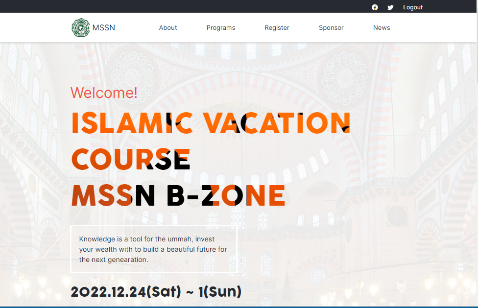
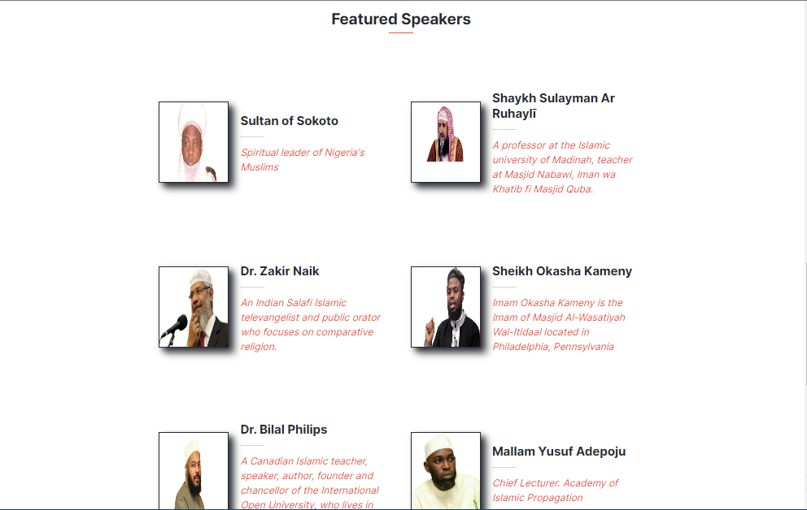
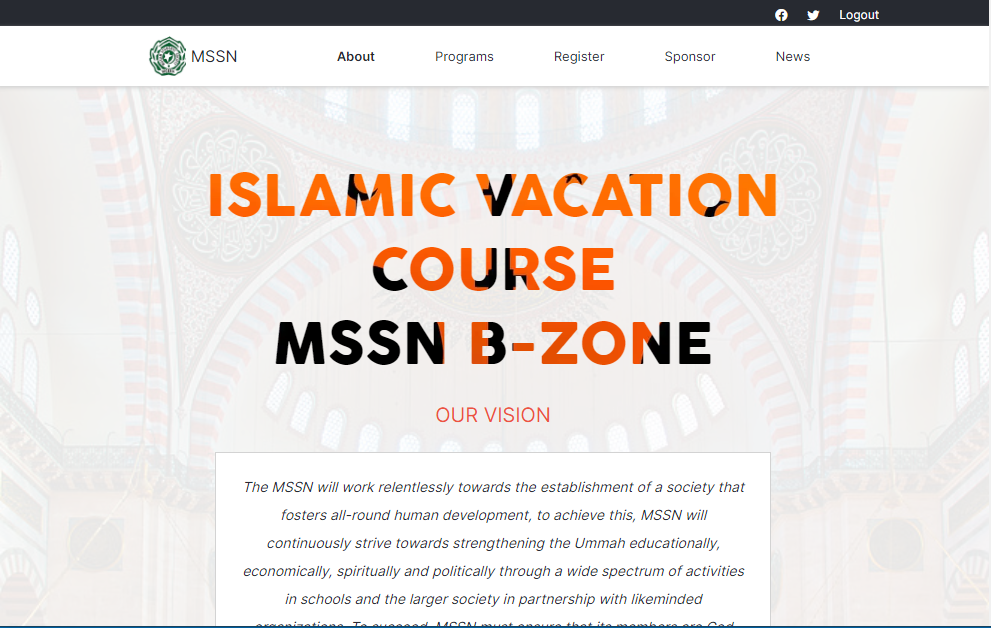
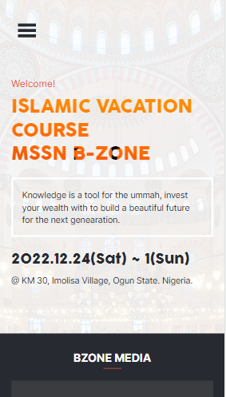
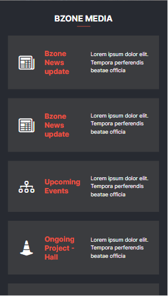
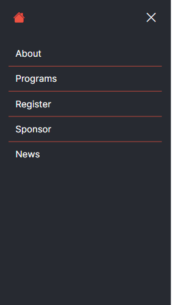

# Microverse Capstone Project

> This project is the Final capstone project of the first module at microverse. It is aim at building responsive UI of an online website for a conference, so in this project I built the home and the about page of the conference page (and readable) on all screens.
The template I used to create this template was originally designed by [Cindy Shin in Behance.](https://www.behance.net/adagio07)

https://user-images.githubusercontent.com/78251927/169259625-a6d25707-e7ba-46ae-bce8-3e700f1e775a.mp4

To this project I have added :

- Navigation bar
- A speakers area which is built dynamically with JS
- Two HTML files

## Built With

- HTML
- CSS 
- JavaScript

## Screenshots






## Live Demo

Click here - [Live Demo](https://abdulhamiid.github.io/capstone-project/)

## Getting Started

To get a local copy up and running follow these simple example steps.

### Clone this repository
Run this command
```
git clone https://github.com/abdulhamiid/capstone-project.git
```
Navigate to project directory
```
cd capstone-project
```
### Deployment

Open the ```index.html``` on your Browser


## Author

👤 **Abdulhamid**

- GitHub: [@githubhandle](https://github.com/abdulhamiid)
- Twitter: [@twitterhandle](https://twitter.com/abdulhamid_adio)
- LinkedIn: [LinkedIn](https://linkedin.com/)

## 👏 Acknowledgement 🥇
This page design was an inspiration from the original design idea by [Cindy Shin in Behance.](https://www.behance.net/adagio07)

## 🤝 Contributing

Contributions, issues, and feature requests are welcome!

Feel free to check the [issues page](https://github.com/abdulhamiid/capstone-project/issues).

## Show your support

Give a ⭐️ if you like this project!
